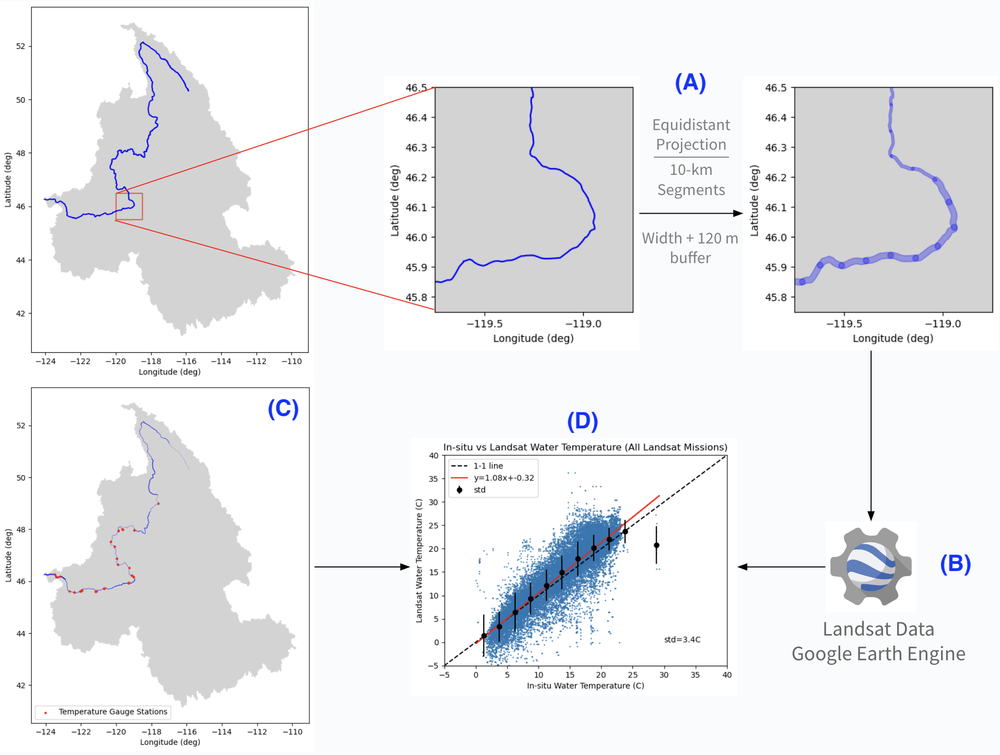
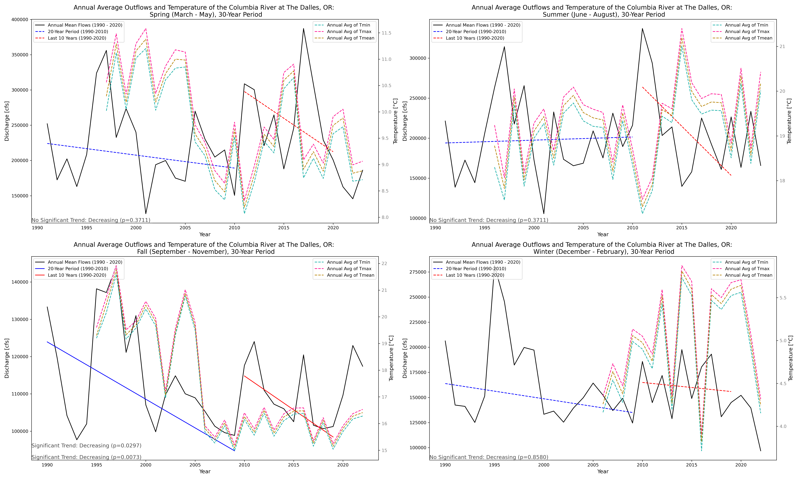
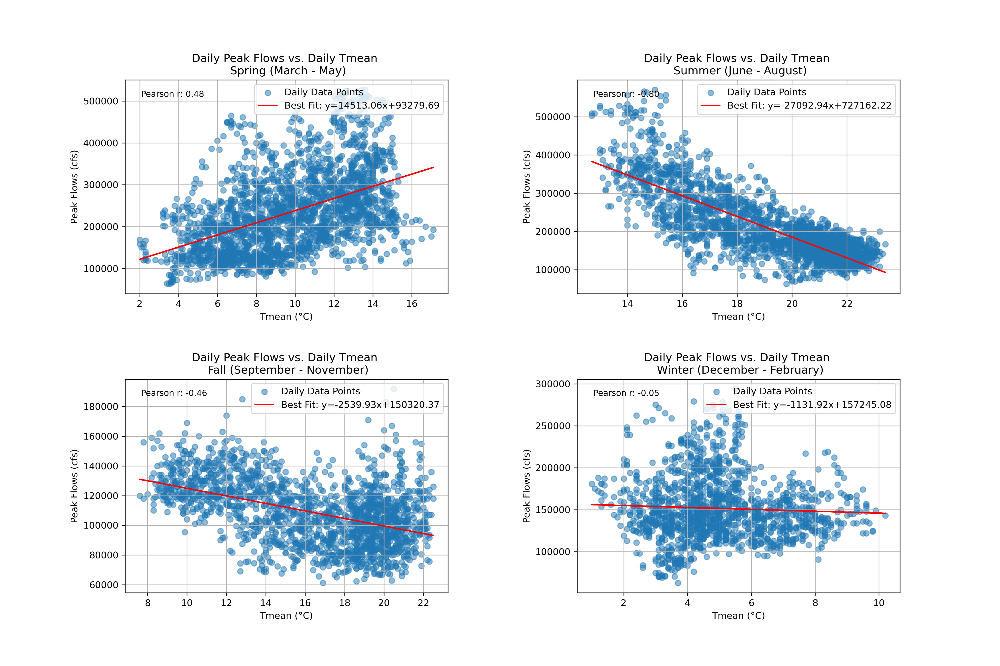
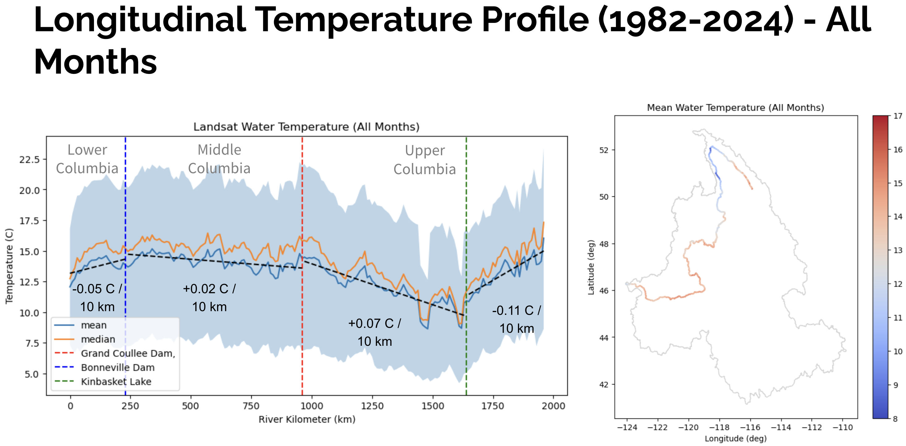
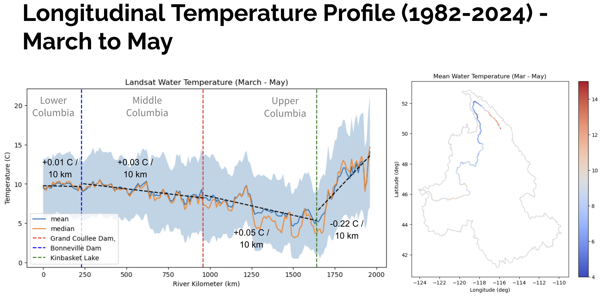
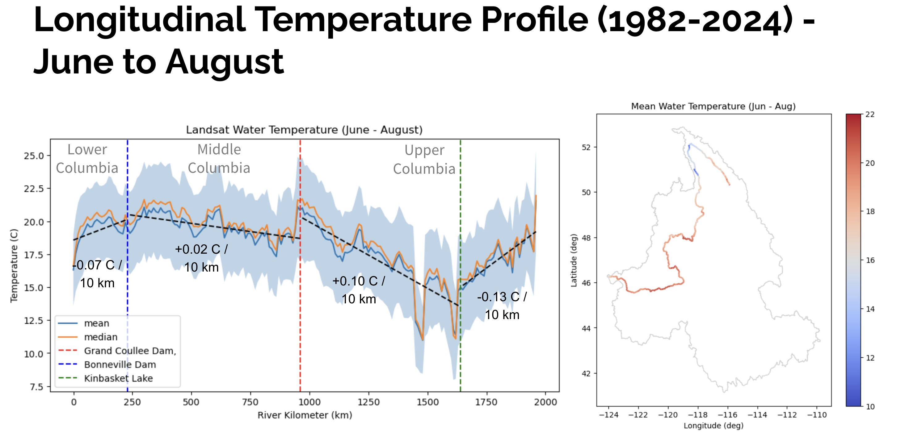
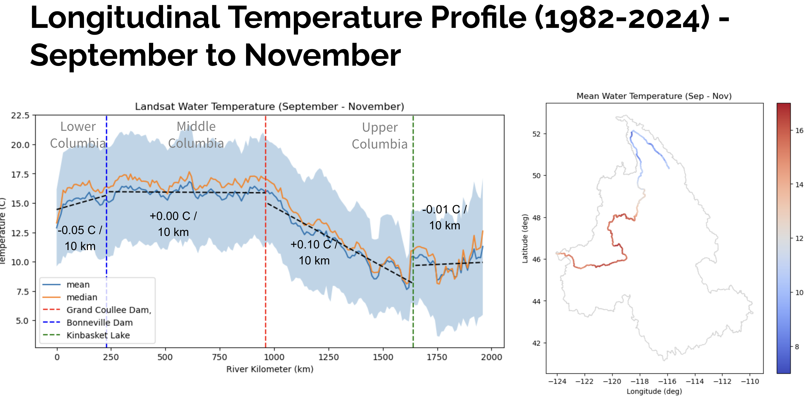
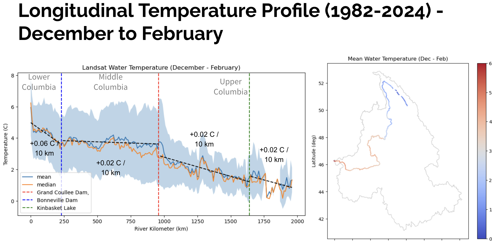

# Columbia DRivT (Columbia Dams and River Temperature)
Team members: Oriya Villarreal, George K. Darkwah

## Summary
This study investigates the impact of dams on river temperature along the Columbia River, using historical satellite and climate data. The ultimate goal is to understand the complexity of sustainable dam operations that protect aquatic life while maintaining societal advantages. 

## Background
The Columbia River Basin is approximately 668,000 sq km (258,000 sq mi). The basin is located in the Pacific Northwest region of the North American continent. It spans five states in the United States - Washington, Oregon, Idaho, Montana, and Nevada - and the British province in Canada. The basin drains into the Columbia River which is approximately 2,000 km (1,243 mi). The Columbia River flows northward from the headwaters at Fairmont, BC, and makes a turn at Kinbasket Lake where it flows southward and discharges into the Pacific Ocean. There are about 14 major dams along the Columbia River, serving different purposes such as flood control, hydropower generation, and irrigation. The Columbia River and its tributary serve as a major habitat for different salmon and fish species.

In this project, we studied temperature patterns along the Columbia River. We also analyzed the relationship between dam operation at the Dalles Dam and immediate downstream water temperature.

[We will explore how dams, while beneficial for irrigation, hydropower, and flood control, adversely affect river temperatures and fish habitats. Through analyzing historical satellite and climate data, we aim to understand the thermal dynamics of the Columbia River, focusing on the challenge of maintaining sustainable dam operations that safeguard fish populations without compromising their benefits to society]: #

## Question
How does water temperature vary along the Columbia River, and how is the temperature variation related to dam operations? 

## Datasets
| Data | Source|
|---|---|
| Vector Datasets (Basin, River Lines) | [The National Map - USGS](https://apps.nationalmap.gov/downloader/) |
| In-situ temperature records (1990 - 2020) | [Nationanl Water Dashboard - USGS](https://dashboard.waterdata.usgs.gov/) |
| In-situ flow records (1990 - 2020) | [Nationanl Water Dashboard - USGS](https://dashboard.waterdata.usgs.gov/) |
| Streamflow Data Outflow at The Dalles Dam, OR (1990 - 2020) | [Columbia River at the Dalles, OR - 14105700](https://waterdata.usgs.gov/monitoring-location/14105700/#parameterCode=00010&period=P7D&showMedian=false) |
| Water surface temperature (1982 - 2024) | [Landsat 4, 5, 7, 8, 9 - Google Earth Engine](https://developers.google.com/earth-engine/datasets/catalog/landsat) |
| River Widths | [Global River Widths from Landsat (GRWL) Database](https://zenodo.org/records/1297434) |

## Tools and packages
* [Contextily](https://contextily.readthedocs.io/)
* [Earth Engine Python API](https://developers.google.com/earth-engine/tutorials/community/intro-to-python-api)
* [Geopandas](https://geopandas.org/)
* [Matplotlib](https://matplotlib.org/)
* [Numpy](https://numpy.org/)
* [Pandas](https://pandas.pydata.org/)
* [SciPy](https://scipy.org/)
* [Seaborn](https://seaborn.pydata.org/)
* [Shapely](https://shapely.readthedocs.io/)
* [Xarray](https://docs.xarray.dev/)

## Methodology
This project consisted of two major steps:
1. Trend analyses at the Dalles Dam, OR
2. Longitudinal assessment of water temperature along the Columbia River.

**Links to Scripts and Notebooks:**

* [*Statistical Functions*](Methods/05-functions.py)
* [*Trend Analysis Notebook*](Methods/06-ov-seasonal-trends.ipynb)
* [*Segmenting the Columbia River*](Methods/01-break_rivers_into_reaches.ipynb)
* [*In Situ vs. Landsat Data*](Methods/03-exploratory_data_analysis.ipynb)
* [*Columbia River Longitudinal Temperature Profile*](Methods/04-longitundinal_temp_profile.ipynb)

--- 

### 1. Trend analyses at the Dalles Dam, OR

#### 1.1 - Below The Dalles, OR: Data Filtering and Statistical Functions

We collected and analyzed 30 years (1990 - 2020) of daily mean discharge and daily mean, maximum, and minimum water temperatures for the downstream reach of the Columbia River, below The Dalles dam.

* First, we analyze our data based on seasonal changes over a 30-year period. To do this, we needed to reorganize the dates in our file to make them easy to work with. We converted our date column to datetime format using `pd.to_datetime`. Then, we set the date column as the index using `.set_index`.
* After indexing our dates, we created a function called `return_months`, which filters through our date column and returns data for specific months we want to work with:
  
        def return_months(dataframe, months:list):
                '''
                function filters through our `months` column and returns data for
                the specific months  we want to look at 
                '''
          df = dataframe.loc[dataframe.index.month.isin(months)]
    
          return df

* Next, we decided to compare the first 20 years of our data, 1990 - 2010, to the last 10 years of our data, 2010 - 2020 using a Mann-Kendall Test and Sen's Slope. We created a function for each statistical test:

        def mann_kendall(V, alpha=0.05):
  
        V = np.reshape(V, (len(V), 1))
        alpha = alpha/2
        n = len(V)
        S = 0

        for i in range(0, n-1):
          for j in range(i+1, n):
              if V[j]>V[i]:
                  S = S+1
            if V[j]<V[i]:
                  S = S-1

      VarS = (n*(n-1)*(2*n+5))/18
      StdS = np.sqrt(VarS)
      # Ties are not considered

      # Kendall tau correction coefficient
      Kendall_Tau = S/(n*(n-1)/2)
      if S>=0:
          if S==0:
               Z = 0
          else:
              Z = ((S-1)/StdS)
      else:
          Z = (S+1)/StdS

      Zalpha = st.norm.ppf(1-alpha,0,1)
      p_value = 2*(1-st.norm.cdf(abs(Z), 0, 1)) #Two-tailed test p-value

      reject_null = abs(Z) > Zalpha # reject null hypothesis only if abs(Z) > Zalpha

    
      return reject_null, p_value

  and Sen's Slope:

      def sens_slope(y):
          n = len(y)
          slopes = []
          for i in range(n - 1):
              for j in range(i + 1, n):
                  slope = (y[j] - y[i]) / (j - i)
                  slopes.append(slope)
          sens_slope = np.median(slopes)
          return sens_slope

* Next, we segmented our 30-year record data by defining periods for statistical testing, comparing 1990-2010 to 2010-2020. Additionally, we segmented and defined seasons using the indexed months function.
* Lastly, we created 4 subplots for each season and included our trend analysis results for 1990-2010 and 2010-2020. Using our filtered seasonal dates and Trend Analysis functions, we created two time series analysis plots. The first plot represents Seasonal Mean Discharge vs Seasonal Mean, Min, and Max Temperature values over 30 years. The second plot represents Seasonal Peak Flows vs. Seasonal Mean, Min, and Max Temperature values over 30 years. Each plot calculates trends for the specific seasonal months over a 30-year period (See Results Section).

* To better understand the relationship between outflow below The Dalles and temperature data, we created scatterplots to investigate correlations between discharge and water temperature for each season overa 30-year period. We created scatter plots for mean daily outflow vs. mean temperature, and monthly peak flows vs. mean temperature (see Results Section).

### 2. Longitudinal assessment of water temperature along the Columbia River.

#### 2.1 - Collection of Landsat water temperature
We collected historical water surface temperature from Landsat 4, 5, 7, 8, and 9 along the Columbia River. 
* (A) To do this, we first divided the Columbia River into 10-km reaches starting from the outlet into the Pacific Ocean. Dividing the river into segments of a specific distance required an equidistant projection. We defined an Alber's Equidistant projection based on the extent and centroid of the basin polygon. We then buffered the reaches by adding 120 m on each side of the reach width. We obtained the reach widths from the GRWL dataset using a spatial join by nearest (`sjoin_nearest` function in `GeoPandas`).
* (B) With the buffered polygon, we use the Google Earth Engine API to extract the Landsat water surface temperature for each reach on days with Landsat observations.
* (C) Before comparing our Landsat temperature, we selected the in-situ temperature gauges that intersected with the buffered reaches. We used a spatial join (`sjoin` function in `GeoPandas`) to assign location attributes of each reach to the corresponding temperature gauges.
* (D) A comparison of the in-situ temperature with the Landsat temperature shows a consistent variance in the Landsat water surface temperature. Sometimes, there were as many overestimates as there were underestimates.

[Our methodology involves analyzing river temperature data, salmonid counts, and dam outflows at The Dalles Dam in the Columbia River Basin, using a range of tools and Python packages for data visualization to illustrate temperature changes along the river. This approach will enable us to quantify the impact of dam operations on river temperature and its subsequent effects on aquatic life, particularly focusing on how temperature variations influence salmonid distributions downstream of the dam. * Data Visualiztion using Scikit Learn (?), matplotlib, and NumPy]: #

## Results

### 1. Seasonal Trend Analysis Results:

#### Spring (March - May) Plot:
* **Discharge**: The black line represents the annual peak flows, showing variability over the years without a clear long-term trend.
* **Temperature**: The dashed lines in various colors represent the annual average temperatures (minimum, maximum, and mean).
* **Trend**: A blue solid line indicates the trend in peak flows during the 20-year period (1990-2010), and the red dashed line represents the trend in the last 10 years (2010-2020). In this case, there is no statistically significant trend in peak flows as annotated by "No Significant Trend: Decreasing (p=0.7205)", suggesting that despite a visual decrease, it is not statistically significant.

#### Summer (June - August) Plot:
* **Trend**: Similar to Spring, both trend lines for the defined periods are present, but the Mann-Kendall test indicates "No Significant Trend: Decreasing (p=0.5915)" for the peak flows, meaning any decrease is not statistically confirmed.

#### Fall (September - November) Plot:
* **Trend**: Here, the blue solid line shows a significant decreasing trend in peak flows for the period of 1990-2010 with a p-value of 0.0253, as indicated by the annotation "Significant Trend: Decreasing (p=0.0253)". This implies that the decrease in peak flows during the Fall season is statistically significant over this 20-year period.

#### Winter (December - February) Plot:
* **Discharge**: The peak flow line shows dramatic fluctuations, which is typical for winter seasons where precipitation can vary widely.
* **Temperature**: The average temperature trends show seasonal variations, with some years warmer or cooler than others.
* **Trend**: Despite the visual appearance of a decreasing trend in the last 10 years (red dashed line), the annotation "No Significant Trend: Increasing (p=0.8580)" indicates that there is no statistically significant trend, and any apparent increase in peak flows is not supported by the statistical test.

#### Overall Assessment:
The detailed annotations in each plot are critical, as they convey the result of statistical tests rather than relying solely on visual interpretation, which can be misleading. The use of p-values (probability values) allows for determining the statistical significance of trends. A p-value below a certain threshold (commonly 0.05) indicates a statistically significant trend.

#### For peak flows:
Only the Fall season shows a statistically significant decreasing trend over the entire 30-year period.
Other seasons do not show statistically significant trends, despite what the visual lines might suggest.

#### For temperatures:
They provide a visual representation of the variability in temperatures over the same time frames.

#### Seasonal Scatterplots:

#### Spring: 
* There's a positive correlation indicated by an upward-sloping line. This suggests that as the temperature increases, the peak flows also tend to increase. This might be due to melting snow and ice contributing to the river flow as temperatures rise.

#### Summer: 
* There's a negative correlation shown by a downward-sloping line. This implies that higher temperatures may be associated with lower peak flows, possibly due to higher evaporation rates or reduced snowmelt.

#### Fall: 
* Similar to summer, there's a negative correlation, with the best-fit line sloping downwards. This indicates that the peak flows decrease as the temperature increases.

#### Winter: 
* The correlation here is not as clear as in other seasons. The best-fit line is relatively flat, which suggests that there's a weak or no significant relationship between the temperature and peak flows during winter. This could be due to the river's flow being less dependent on temperature changes in the winter months, potentially because the flow could be influenced by factors like ice cover or consistent precipitation patterns.

The presence of a strong positive or negative slope in the scatter plots would imply a strong relationship between temperature and peak flows. However, the winter plot shows that this relationship is not consistent across seasons, and there may be other seasonal factors affecting river flows.

### 2. Longitudinal Temperature profile along the Columbia River
Using the Landsat water surface temperature at the 10-km reaches, we generated plots of the temperature profile along the Columbia River. This shows the long-term average water temperature from 1982 to 2024. We divided the Columbia River into three major sections:
1. Lower Columbia - From Bonneville Dam (RKm 230), downstream to the Pacific Ocean (RKm 0)
2. Middle Columbia - From the Grand Coulee Dam (RKm 960) to the Bonneville Dam.
3. Upper Columbia - From the headwaters at Fairmont to the Grand Coulee Dam.

We divided the Upper Columbia into two sections, the section from Fairmont to Kinbasket Lake and from Kinbasket Lake to Grand Coulee. This is because of the apparent difference in temperature profile in these two sections of the Upper Columbia.

The longitudinal profile showed different long-term trends in the various sections and in different seasons. Generally, the upstream section of the Upper Columbia starts off with high temperatures because of the hot springs at the headwater of the Columbia River. This hot water is cooled down by cold water from the Kootenay mountain range before the river makes a turn at Kinbasket Lake.

We observed a general downstream heating after Kinbasket Lake, especially in the winter and spring months. However, in the summer, there was rather low to no downstream heating in the middle Columbia. This is likely due to the interactions between tributaries and dam operations. We noticed an abrupt downstream cooling at the Grand Coulee Dam. This is likely due to the effect of thermal stratification and the discharge of cold water from the bottom of the dam. After the Bonneville Dam, the river either heated up or cooled down to match the temperature of the Pacific Ocean at the mouth, depending on the season.

## Conclusion
1. Our Seasonal Trend analysis over 30 years gives insight into the relationship between river temperatures and dam operations. To some extent, our time series plots support these seasonal correlations. There is a significant decreasing trend in peak flows noted in the fall, suggesting adaptive dam management in response to temperature variations. However, no statistically significant trends in peak flows were observed for spring, summer, and winter, implying that temperature is not the sole factor influencing dam operations during these seasons. Scatterplots of discharge and temperature data show that in the spring, there is a positive correlation between temperature and dam discharge, which may reflect operational increases in discharge to manage the influx of meltwater and prepare for salmon migration downstream. Conversely, during the summer and fall, a negative correlation suggests that dam operations might reduce discharge as temperatures rise, possibly as a response to higher evaporation rates or to conserve water levels. In winter, the correlation is minimal, indicating that temperature has less influence on discharge, with dam operations possibly prioritizing other factors such as flood control or energy generation demands.  
Overall, while there is some seasonal relationship between temperature and dam operations, particularly in spring and fall, the data indicates that dam management decisions are likely based on a combination of factors, including but not limited to river temperature, environmental conservation efforts, hydroelectric power needs, and broader climate patterns. This underscores the complexity of managing river systems and the necessity for integrated approaches that consider a variety of environmental and operational data.
2. In general there is a downstream heating along the Columbia River. However, the Columbia River starts off warm due to the hot springs at Fairmont. The geothermally heated water resurfaces at the head of the Columbia River. This is likely cooled down by snowmelt from the mountain range as the river flows northwards to the Kinbasket Lake. Thereafter, we see a downstream heating trend.
3. The Middle Columbia (from Grand Coulee to Bonneville) experiences the least rate of change in temperature along the river. This could be a result of the dams located within this stretch of the Columbia River.
4. There is a summer cooling effect downstream of large dams such as the Grand Coulee. This is due to thermal stratification of the reservoir and when water is discharged from the cool bottom layer of the reservoir.

## References

*Historical Data - The Dalles*, https://waterdata.usgs.gov/nwis/dv/?site_no=14105700&referred_module=sw

*Non-parametric trends - Sen's Slope*, https://developers.google.com/earth-engine/tutorials/community/nonparametric-trends

*The Dalles Operations*, https://www.nwp.usace.army.mil/The-Dalles/ 
